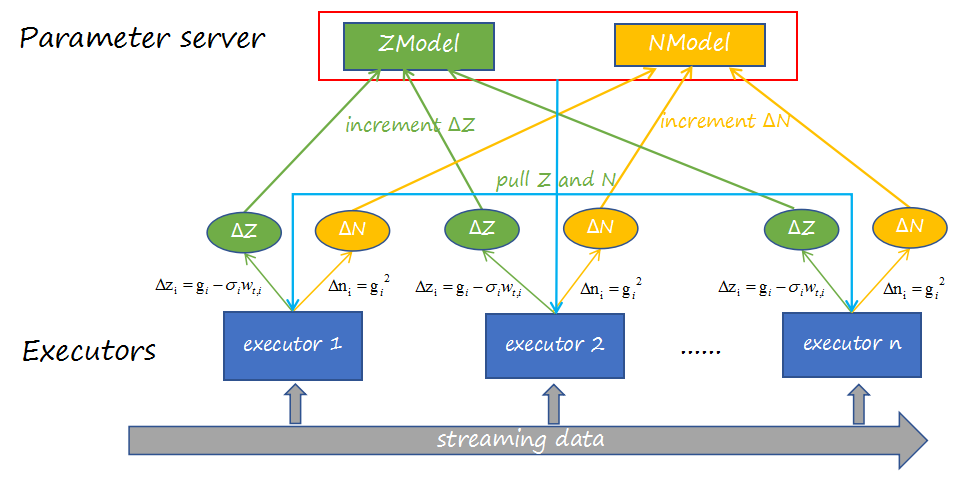

# [Spark Streaming on Angel] FTRL

>FTRL是一种在线学习的常见优化算法，方便实用，而且效果很好，常用于更新在线的CTR预估模型。之前的传统实现多见于Storm。但是实际应用中，数据集的维度往往很大，且模型稀疏性，这种Case下，用Spark Streaming结合Angel，其实会有更好的效果，而且代码很少，性能稳健。


## 1. 算法介绍

 `FTRL`算法兼顾了`FOBOS`和`RDA`两种算法的优势，既能同FOBOS保证比较高的精度，又能在损失一定精度的情况下产生更好的稀疏性。
 
该算法的特征权重的更新公式为：


其中

* G函数表示损失函数的梯度


* w的更新公式（针对特征权重的各个维度将其拆解成N个独立的标量最小化问题）


* 如果对每一维度的学习率单独考虑，w的更新公式：


## 2.分布式实现

Google给出的带有L1和L2正则项的基于FTRL优化的逻辑回归算法的工程实现


参考实现，结合Spark Streaming和Angel的特点，其分布式实现的框架图如下：



## 3. 运行 & 性能


###  **输入格式**
* dim：输入数据的维度 
* 格式：消息格式仅支持标准的["libsvm"](./data_format.md)数据格式
* 本算法以kafka为消息发送机制，使用时需要填写kafka的配置信息。

### **参数说明**

* **算法参数**  
	* alpha：w更新公式中的alpha 
	* beta: w更新公式中的beta
	* lambda1: w更新公式中的lambda1
	* lambda2: w更新公式中的lambda2

* **输入输出参数**
	 * checkPointPath：streaming流数据的checkpoint路径   
	 * modelPath：每批数据训练完后模型的保存路径
	 * actionType："train"表示训练，"predict"表示预测
	 * sampleRate：预测时用来控制样本的输入比例
	 * zkQuorum:Zookeeper的配置信息，格式："hostname:port"
	 * topic:kafka的topic信息
	 * group:kafka的group信息
	 * streamingWindow：控制spark streaming流中每批数据的持续时间

* **资源参数**
	* num-executors：executor个数   
	* executor-cores：executor的核数    
	* executor-memory：executor的内存    
	* driver-memory：driver端内存    
	* spark.ps.instances:Angel PS节点数
	* spark.ps.cores:每个PS节点的Core数
	* spark.ps.memory：每个PS节点的Memory大小

###  **提交命令**

可以通过下面命令向Yarn集群提交FTRL_SparseLR算法的训练任务:

```shell
./bin/spark-submit \
--master yarn-cluster \
--conf spark.yarn.allocation.am.maxMemory=55g \
--conf spark.yarn.allocation.executor.maxMemory=55g \
--conf spark.ps.jars=$SONA_ANGEL_JARS \
--conf spark.ps.instances=2 \
--conf spark.ps.cores=2 \
--conf spark.ps.memory=10g \
--jars $SONA_SPARK_JARS \
--name "spark-on-angel-sparse-ftrl" \
--driver-memory 1g \
--num-executors 5 \
--executor-cores 2 \
--executor-memory 2g \
--class com.tencent.angel.spark.ml.classification.SparseLRWithFTRL \
spark-on-angel-mllib-2.1.0.jar \
partitionNum:3 \
actionType:train \
sampleRate:1.0 \
modelPath:$modelPath \
checkPointPath:$checkpoint \
group:$group \
zkquorum:$zkquorum \
topic:$topic
```

